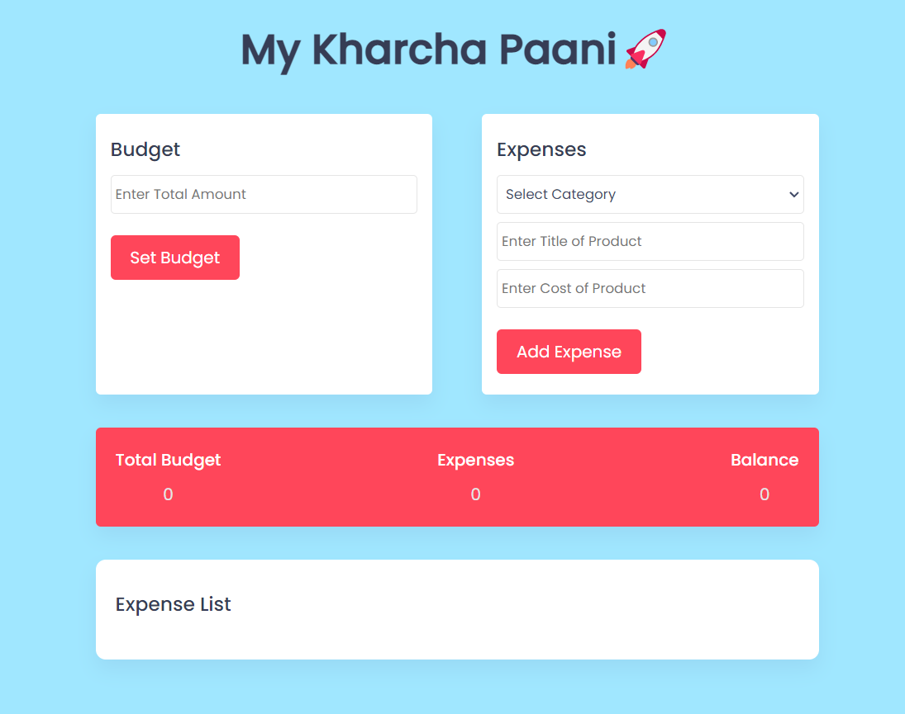

# KharchaPaani App

Welcome to the KharchaPaani App repository! This repository contains the source code for a simple expense tracker application powered by blockchain technology. The app is designed to help users track their expenses and manage their finances efficiently in a decentralized and secure manner.

## Features

- **Expense Tracking**: Users can easily add and categorize their expenses, helping them keep track of their spending habits.
- **Budget Management**: The app allows users to set budgets for different expense categories, helping them stay within their financial limits.
- **Secure and Private**: KharchaPaani App takes user privacy seriously and ensures that all financial data is securely stored and encrypted.




**Clone the repository**: Use the following command to clone this repository to your local machine: 
   ```bash
   git clone https://github.com/subuxd/KharchaPaani-App.git
   ```

**Access the App Here**:   [KharchaPaani App](https://mykharchapaani.netlify.app/). 

## License

This project is licensed under the MIT License.

## Contact

If you have any questions or suggestions regarding the KharchaPaani App, please feel free to contact the project maintainer, Subham Singh, via [email](mailto:subhamksingh01@gmail.com) or [GitHub](https://github.com/subuxd).

We hope you find KharchaPaani App useful for managing your expenses efficiently!


